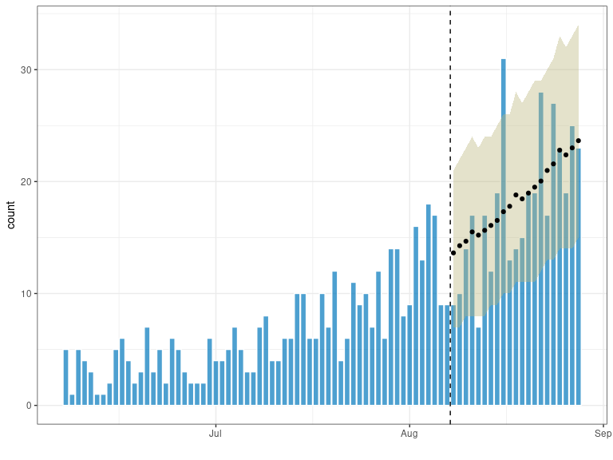

<!-- README.md is generated from README.Rmd. Please edit that file -->

<!-- badges: start -->

[](https://www.repostatus.org/#wip)
[](https://www.tidyverse.org/lifecycle/#experimental)
[](https://CRAN.R-project.org/package=trending)
[](https://codecov.io/gh/reconhub/trending?branch=master)
[](https://github.com/reconhub/trending/actions)
<!-- badges: end -->

<br> **<span style="color: red;">Disclaimer</span>**

This package is a work in progress. Please reach out to the authors
before using.

``` r
library(incidence2) # for easy aggregation
library(outbreaks)  # for data
library(trending)   # for trends
library(tidyverse, warn.conflicts = FALSE)  # for data manipulation
#> ── Attaching packages ──────────────────────────────────────────────── tidyverse 1.3.0 ──
#> ✓ ggplot2 3.3.2     ✓ purrr   0.3.4
#> ✓ tibble  3.0.3     ✓ dplyr   1.0.1
#> ✓ tidyr   1.1.1     ✓ stringr 1.4.0
#> ✓ readr   1.3.1     ✓ forcats 0.5.0
#> ── Conflicts ─────────────────────────────────────────────────── tidyverse_conflicts() ──
#> x dplyr::filter() masks stats::filter()
#> x dplyr::lag()    masks stats::lag()
# -------------------------------------------------------------------------

# use linelist data from outbreaks package
dat <- ebola_sim_clean$linelist

# dates we want to fit to
first_date <- as.Date("2014-06-07")
last_date <- as.Date("2014-08-07")

# Create incidence object data grouped by gender
inci <- incidence(ebola_sim_clean$linelist,
                  date_index = date_of_onset,
                  first_date = first_date,
                  last_date = last_date + 21,   # +3 weeks for later prediction
                  groups = gender)
#> 5047 observations outside of [2014-06-07, 2014-08-28] were removed.


# add some predictive variables
inci <-
  inci %>%
  mutate(day = bin_date, weekday = weekdays(bin_date)) %>%
  mutate(weekday = case_when(weekday == "Monday"   ~ "monday",
                             weekday == "Saturday" ~ "weekend",
                             weekday == "Sunday"   ~ "weekend",
                             TRUE                  ~ "rest of week"))
# -------------------------------------------------------------------------


# split by gender ---------------------------------------------------------

# define model to fit
negbin <- glm_nb_model(count ~ day + weekday)

# split data by gender
split_data <-
  inci %>%
  nest_by(gender) %>%
  mutate(
    model = list(negbin),
    fitting_data = list(filter(data, day <= last_date)),
    predict_data = list(filter(data, day > last_date)),
    fit = list(fit(model, fitting_data)),
    pred = list(predict(fit, predict_data)))
#> Warning: Problem with `mutate()` input `fit`.
#> x iteration limit reached
#> ℹ Input `fit` is `list(fit(model, fitting_data))`.
#> ℹ The error occurred in row 1.
#> Warning in theta.ml(Y, mu, sum(w), w, limit = control$maxit, trace =
#> control$trace > : iteration limit reached
#> Warning: Problem with `mutate()` input `fit`.
#> x iteration limit reached
#> ℹ Input `fit` is `list(fit(model, fitting_data))`.
#> ℹ The error occurred in row 1.
#> Warning in theta.ml(Y, mu, sum(w), w, limit = control$maxit, trace =
#> control$trace > : iteration limit reached
#> Warning: Problem with `mutate()` input `fit`.
#> x iteration limit reached
#> ℹ Input `fit` is `list(fit(model, fitting_data))`.
#> ℹ The error occurred in row 2.
#> Warning in theta.ml(Y, mu, sum(w), w, limit = control$maxit, trace =
#> control$trace > : iteration limit reached
#> Warning: Problem with `mutate()` input `fit`.
#> x iteration limit reached
#> ℹ Input `fit` is `list(fit(model, fitting_data))`.
#> ℹ The error occurred in row 2.
#> Warning in theta.ml(Y, mu, sum(w), w, limit = control$maxit, trace =
#> control$trace > : iteration limit reached

# plot results
input <- split_data %>% select(fitting_data) %>% unnest(cols = c(fitting_data))
#> Adding missing grouping variables: `gender`
output <- split_data %>% select(gender, pred) %>% unnest(cols = c(pred))
res <- bind_rows(input, output)

plotplot(res, "day", "count", facets = "gender")
#> Warning: Removed 124 rows containing missing values (geom_point).
```


``` r
# -------------------------------------------------------------------------


# without gender grouping -------------------------------------------------
x <- inci %>% group_by(day, weekday) %>% summarise(count = sum(count))
#> `summarise()` regrouping output by 'day' (override with `.groups` argument)

# define model to fit
negbin <- glm_nb_model(count ~ day + weekday)

fitting_data <- filter(x, day <= last_date)
predict_data <- filter(x, day > last_date)

fitted_model <- fit(negbin, fitting_data)
#> Warning in theta.ml(Y, mu, sum(w), w, limit = control$maxit, trace =
#> control$trace > : iteration limit reached

#> Warning in theta.ml(Y, mu, sum(w), w, limit = control$maxit, trace =
#> control$trace > : iteration limit reached
pred <- predict(fitted_model, predict_data)

res <- bind_rows(fitting_data, pred)

plotplot(res, "day", "count")
#> Warning: Removed 62 rows containing missing values (geom_point).
```


