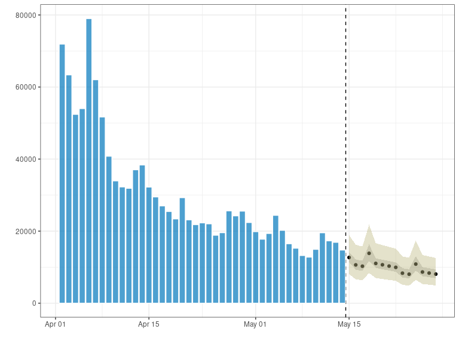

<!-- README.md is generated from README.Rmd. Please edit that file -->

<!-- badges: start -->

[](https://www.repostatus.org/#wip)
[](https://www.tidyverse.org/lifecycle/#experimental)
[](https://CRAN.R-project.org/package=trending)
[](https://codecov.io/gh/reconhub/trending?branch=master)
[](https://github.com/reconhub/trending/actions)
<!-- badges: end -->

<br> **<span style="color: red;">Disclaimer</span>**

This package is a work in progress. Please reach out to the authors
before using.

# Trending

*trending* aims to provides a coherent interface to several modelling
tools. Whilst it is useful in an interactive context, it’s main focus is
to provide an intuitive interface on which other packages can be
developed
(e.g. [*trendbreaker*](https://github.com/reconhub/trendbreaker)).

## Main features

  - **Model specification:** Interfaces to common models through
    intuitive functions; `lm_model()`, `glm_model()`, `glm_nb_model`\*
    and `brms_model`\*\*.

  - **Model fitting and prediction:** Once specified, models can be fit
    to data and generate confidence and prediction intervals for future
    data using `fit()` and `predict()`.

  - **Plotting functionality** A basic plotting method for trending
    model predictions.

\*  Requires [MASS](https://CRAN.R-project.org/package=MASS)  
\*\* Requires [brms](https://CRAN.R-project.org/package=brms)

## Installing the package

Once it is released on [CRAN](https://CRAN.R-project.org), you will be
able to install the stable version of the package with:

``` r
install.packages("trending")
```

The development version can be installed from
[GitHub](https://github.com/) with:

``` r
if (!require(remotes)) {
  install.packages("remotes")
}
remotes::install_github("reconhub/trending", build_vignettes = TRUE)
```

## Example usage

### An individual model

``` r
library(outbreaks)  # for data
library(trending)   # for trend fitting
library(dplyr, warn.conflicts = FALSE)  # for data manipulation

# load data
data(covid19_england_nhscalls_2020)

# define a model
model  <- glm_nb_model(count ~ day + weekday)

# select 6 weeks of data (from a period when the prevalence was decreasing)
last_date <- as.Date("2020-05-28")
first_date <- last_date - 8*7
pathways_recent <-
  covid19_england_nhscalls_2020 %>%
  filter(date >= first_date, date <= last_date) %>%
  group_by(date, day, weekday) %>%
  summarise(count = sum(count), .groups = "drop")

# split data for fitting and prediction
dat <-
  pathways_recent %>%
  group_by(date <= first_date + 6*7) %>%
  group_split()

fitting_data <- dat[[2]]
pred_data <- select(dat[[1]], date, day, weekday)

fitted_model <- fit(model, fitting_data)

# confidence and prediction intervals
pred <- predict(fitted_model, pred_data)
glimpse(pred)
#> Rows: 14
#> Columns: 8
#> $ date     <date> 2020-05-15, 2020-05-16, 2020-05-17, 2020-05-18, 2020-05-19, 2…
#> $ day      <int> 58, 59, 60, 61, 62, 63, 64, 65, 66, 67, 68, 69, 70, 71
#> $ weekday  <fct> rest_of_week, weekend, weekend, monday, rest_of_week, rest_of_…
#> $ pred     <dbl> 12682, 10625, 10262, 13840, 11036, 10659, 10295, 9943, 8330, 8…
#> $ lower_ci <dbl> 11390, 9299, 8956, 11749, 9782, 9416, 9064, 8724, 7138, 6872, …
#> $ upper_ci <dbl> 14122, 12140, 11759, 16303, 12450, 12066, 11693, 11333, 9721, …
#> $ lower_pi <dbl> 8107, 6618, 6373, 8363, 6962, 6701, 6450, 6208, 5079, 4889, 64…
#> $ upper_pi <dbl> 18870, 16223, 15714, 21784, 16638, 16124, 15626, 15145, 12992,…
plot(pred, "date", fitted_data = fitting_data, fitted_y = "count")
```



### Model selection

You can define a number of different regression models using a common
interface. Once defined you can use different strategies to select the
best-fitting/best-predicting model.

As an example we try to predict `hp` of the famous `mtcars` dataset. Of
course, this is just a toy example. Usually you would use the package to
predict counts data in a time series.

First we define some potential models:

``` r
stan_cache <- tempfile() # stan compile to c++ and we cache the code
models <- list(
  null = lm_model(hp ~ 1),
  glm_poisson = glm_model(hp ~ 1 + cyl + drat + wt + qsec + am, poisson),
  lm_complex = lm_model(hp ~ 1 + cyl + drat + wt + qsec + am),
  negbin_complex = glm_nb_model(hp ~ 1 + cyl + drat + wt + qsec + am),
  brms_complex = brms_model(
    hp ~ 1 + cyl + drat + wt + qsec + am,
    family = brms::negbinomial(),
    file = stan_cache
  )
)
```

Then we evaluate them using [N-Fold cross
validation](https://en.wikipedia.org/wiki/Cross-validation_\(statistics\)).

``` r
# we do CV and evaluate three loss function:
# Root-mean-squared error, the huber-loss and mean absolute error.
# The package works with `yardstick` by default.
out <- capture.output( # no log output in readme :)
  auto_select <- select_model(mtcars, models,
    method = evaluate_resampling,
    metrics = list(yardstick::rmse, yardstick::huber_loss, yardstick::mae)
  )
)
auto_select$leaderboard
#> # A tibble: 5 x 4
#>   model          huber_loss   mae  rmse
#>   <chr>               <dbl> <dbl> <dbl>
#> 1 brms_complex         16.7  17.2  17.2
#> 2 glm_poisson          21.2  21.7  21.7
#> 3 negbin_complex       22.8  23.3  23.3
#> 4 lm_complex           26.2  26.7  26.7
#> 5 null                 57.8  58.3  58.3
```

# Resources

## Vignettes

An overview of *trending* is provided in the included vignette: \*
`vignette("Introduction", package = "trending")`

## Websites

The following websites are available:

  - The *trending* project on *github*, useful for developers,
    contributors, and users wanting to post issues, bug reports and
    feature requests: <br> <https://github.com/reconhub/trending>

## Getting help online

Bug reports and feature requests should be posted on *github* using the
[*issue* system](https://github.com/reconhub/incidence2/issues). All
other questions should be posted on the **RECON** slack channel see
<https://www.repidemicsconsortium.org/forum/> for details on how to
join.
